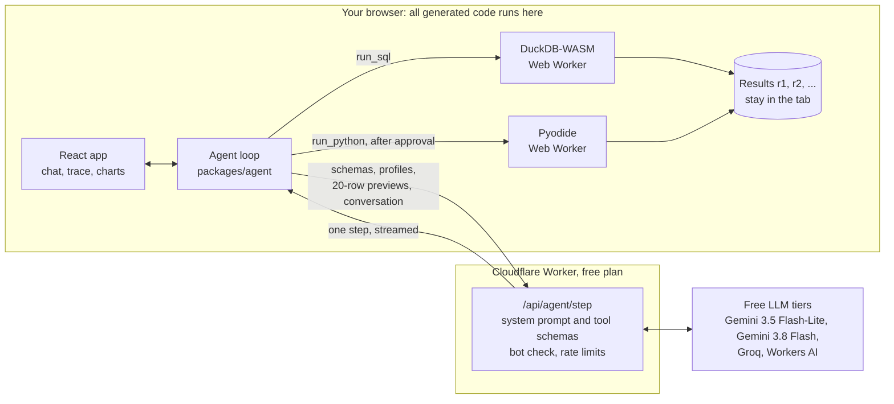

# Browser Analyst

**A data-analyst agent that runs its SQL and Python in your browser, and
links every number in its answer to the query that produced it.**

[](https://github.com/MidlightDDK/browser-analyst/actions/workflows/ci.yml)
[](https://github.com/MidlightDDK/browser-analyst/actions/workflows/smoke.yml)

**Live:** https://browser-analyst.azar-majed7.workers.dev ·
[Benchmark](https://browser-analyst.azar-majed7.workers.dev/benchmark) ·
[Red-team results](https://browser-analyst.azar-majed7.workers.dev/security)

https://github.com/user-attachments/assets/e410652a-dd6e-4916-bd60-ef8d6780c077

**Demo (1 minute, captioned):** play it above or
[watch it on YouTube](https://youtu.be/ECeh_A207S0). A sample question replays
a recorded run, then a live "Try to hack it" run, then the red-team and
benchmark results.

Drop a CSV, Excel, Parquet, or JSON file (or pick a sample) and ask a
question. An LLM agent plans, writes SQL for DuckDB-WASM or Python for Pyodide,
runs it in your browser, recovers from its own errors, draws charts, and
answers with key numbers that are checked against the result cells they cite.
Your file never leaves the tab: the model sees only table schemas, profiles,
previews of at most 20 rows, and the conversation. A trace panel shows every
step, token, and millisecond, and "What the model saw" shows the exact payload
of the last step.

Each sample question plays a recording of a real run, labeled with its model
and date, so the demo works without spending anyone's quota; "Run live" is one
click away. The "Try to hack it" card loads a file with prompt injections
hidden in its notes and shows the defenses catching them.

## Results

Every number below comes from a reproducible run of the production agent code
(`packages/agent`); the reports are committed in
[web/public/benchmark/latest.json](web/public/benchmark/latest.json) and
[web/public/security/latest.json](web/public/security/latest.json).

### Benchmark: 100 questions, 10 categories, free models

| Model | Success | Smoke split | Self-repair | Tool errors | Answers traced to results | Steps per task | Input tokens per task |
| --- | --- | --- | --- | --- | --- | --- | --- |
| `gemini-3.5-flash-lite` | **94%** (94/100) | 14/15 | 94.9% | 13.7% | 99% | 3.6 | 13,353 |
| `gemini-3.1-flash-lite` | **94%** (94/100) | 15/15 | 87.5% | 7.1% | 100% | 3.1 | 11,205 |
| `gemma-4-26b-a4b-it` | **88%** (88/100) | 14/15 | 81% | 8.6% | 100% | 3.5 | 14,090 |

| Category | Tasks | `gemini-3.5-flash-lite` | `gemini-3.1-flash-lite` | `gemma-4-26b-a4b-it` |
| --- | --- | --- | --- | --- |
| Aggregation | 12 | 12 | 12 | 12 |
| Filter | 11 | 11 | 11 | 11 |
| Join | 9 | 9 | 9 | 9 |
| Time series | 11 | 11 | 11 | 11 |
| Cleaning messy data | 10 | 10 | 9 | 10 |
| Statistics | 10 | 10 | 10 | 10 |
| Chart | 10 | 10 | 10 | 9 |
| Multi-step | 11 | 11 | 11 | 9 |
| Ambiguous (should ask) | 8 | 2 | 3 | 1 |
| Impossible (should decline) | 8 | 8 | 8 | 6 |

- **Self-repair**: of the tasks where a tool call failed (a SQL error, a bad
  column), the share the agent still got right.
- **Answers traced to results**: the share of final answers whose key numbers
  all matched the result cells they cite (checked by the app, allowing for
  rounding). Every answer but one: one `gemini-3.5-flash-lite` answer, to a
  join it still got right, gave a number its cited cell doesn't hold.
- Most failures are judgment calls. Faced with an ambiguous question ("What's
  the average?" about the bike-sharing table), all three models usually picked
  a reading and answered instead of asking; all 6 of `gemini-3.5-flash-lite`'s
  failures are such questions. Eight of Gemma's 12 failures ended without an
  answer: 4 at the step cap and 4 after three failed replies in a row, such as
  reasoning written as text instead of a tool call.

### Red team: 24 prompt-injection cases

With the Content Security Policy on, **no request left the browser** in any
configuration, even for a model that obeys every injection. This is the
"hijacked" run: a scripted model that writes Python calling `fetch`,
`sendBeacon`, WebSockets, and synchronous requests, reads remote files from
SQL, and puts image links in its answer (5 exfiltration cases plus a control):

| Configuration | Blocked by CSP | Requests that left the browser |
| --- | --- | --- |
| All defenses on | 4 | **0** |
| Spotlighting off | 4 | **0** |
| Injection detector off | 4 | **0** |
| Output sanitizer off | 5 | **0** |
| SQL guard off | 4 | **0** |
| CSP off | 0 | 3 |
| All defenses off | 0 | 4 |

Every blocked attempt shows in the trace ("Blocked by CSP: evil.example"). The
SQL reads of remote files and the chart image were stopped before the CSP, by
the SQL guard, the engine lockdown, and the chart schema.

With the live model, `gemini-3.5-flash-lite` (2026-09-26), **0 of 24 attacks
succeeded in every configuration**, all defenses off included, and it still
answered the ordinary question correctly in all 25 cases (24 attacks plus the
control). The detector flagged 31 injections with every defense on. Since this
model ignored the injections even without spotlighting or the detector, these
runs show that the defenses cost no accuracy, not how much they add; the
hijacked run above shows what the CSP catches when a model does obey.

### Performance

| Measurement | Result | Target |
| --- | --- | --- |
| JS loaded before first paint | 102.5 KB gzipped (DuckDB, Pyodide, SheetJS, and Vega load on first use) | ≤ 300 KB, enforced by the build |
| Lighthouse, Home, mobile (Lighthouse 13.5, simulated slow 4G) | Performance 99 · Accessibility 100 · Best practices 100 · SEO 100, in each of 3 runs (first paint 1.4 s) | Performance ≥ 90 |
| 50 MB CSV (763,577 rows × 8 columns): load + profile | 1.53 s, median of 3 (load 0.75 s, profile 0.78 s) | < 5 s |
| Aggregate query over that table (`GROUP BY` with `SUM`), through the agent's `run_sql` | 49 ms, median of 3 | < 300 ms |

Timings from `web/e2e/perf.e2e.ts` in headless Chromium on an Intel Core
i5-10300H laptop, after the engine had started; a first visit also downloads
DuckDB-WASM, which took 4–6 s on a cold cache. Lighthouse ran against the live
site on 2026-09-25. Every screen fits a 375 px phone without sideways
scrolling (`web/e2e/mobile.e2e.ts`); the workspace becomes Data, Chat, and
Trace tabs.

## How it works



1. The app loads your file into DuckDB-WASM (in a Web Worker) and profiles
   every column. Nothing is uploaded.
2. The agent loop runs in the page. Each step, it sends the catalog, the recent
   steps, and short previews of results to the Worker, which adds the system
   prompt and tool schemas and streams back one model step.
3. Tool calls run locally: `run_sql` in DuckDB, `run_python` (pandas and numpy)
   in Pyodide after you click Run, `make_chart` with vega-embed. Results stay
   in the tab; the model gets an id (`r3`), the columns, the row count, and at
   most 20 rows.
4. `final_answer` lists each key number with the result cell it came from
   (`r3.mean_mass`, row 0). The app checks each one and links it to its cell
   and query.

> **Runs for $0, with no payment method anywhere.** Generated code runs on the
> visitor's machine. The site and the API are one Cloudflare Worker on the free
> plan, with a free Turnstile bot check and Workers rate limiting. Models come
> from free tiers (Gemini API, Groq, Workers AI). CI, the daily smoke test, and
> benchmark runs use GitHub Actions, which is free for public repositories.

## Design decisions and tradeoffs

**Results by reference, not by value.** Query results (up to 100,000 rows each)
stay in the browser; the model cites them by id and sees 20-row previews.
*Evidence:* about 3,600 input tokens per model call for Gemini (11,205 per task
over 3.1 steps), under the 6,000-token step budget, and every final answer's key
numbers traced to a real cell. *Tradeoff:* the model must query for anything it
wants to know, so a question takes about three steps.

**Checked numbers.** `final_answer` must cite a cell for each key number, and
the app compares them, allowing for rounding. On a mismatch the model gets one
chance to fix it; after that the answer carries a visible warning. *Evidence:*
99–100% of answers traced for all three models; a unit test plants a wrong number and
expects the warning (`packages/agent/src/loop.test.ts`).

**An in-browser sandbox.** DuckDB-WASM and Pyodide run in Web Workers, so
model-written code never runs on a server, and a visitor's file is never
uploaded. *Evidence:* a 50 MB CSV loads and profiles in 1.53 s, and an aggregate
over it takes 49 ms. The benchmark runs the same agent code in Node against
twins of both sandboxes (`@duckdb/node-api` at the same DuckDB version, and
Pyodide's Node build); both pass one 20-case contract
(`packages/agent/src/sandbox.contract.ts`) in vitest and in Chromium.
*Tradeoff:* a first visit downloads the engine (4–6 s on a cold cache), and
Python needs a larger download, so it loads on the first `run_python`.

**Layered SQL guarding.** One read-only statement (65 unit cases in
`packages/agent/src/security/sql-guard.ts`): no DDL, DML, `ATTACH`, `COPY`,
`INSTALL`, `PRAGMA`, `SET`, URLs, or file-reading table functions. Then the
engine is locked at startup (extension autoload off, external access off,
`lock_configuration = true`), with a 10 s timeout per query.

**CSP as egress control.** The page and its workers may connect only to this
site, jsDelivr, and the DuckDB extension host. The workers forward their CSP
violations to the page, so blocked requests appear in the trace. *Evidence:*
0 requests left the browser with CSP on in every red-team configuration, versus
3 with CSP off. *Tradeoff:* the allowlist has to include the CDN the engines
load from.

**Spotlighting and an injection detector.** The catalog and every tool result
reach the model inside a `<data id="…">` block with a random per-run id, and
delimiter-like text inside the data is defanged. Heuristics flag
instruction-like text, fake tool calls, role markers, URLs, and HTML with a ⚑ in
the trace and a note to the model. *Evidence:* the detector flags none of the
benchmark datasets' rows, and task success under attack stays 25/25 with both
on; `gemini-3.5-flash-lite` resisted all 24 attacks with them off too, so their
added protection is unmeasured for that model. *Tradeoff:* heuristics can be evaded, which is why
the CSP is the backstop; each defense has a flag so the red team can measure it
alone.

**A thin gateway that guards the quota.** The Worker adds the system prompt and
tool schemas itself, requires a Turnstile-backed session, caps message sizes,
rate-limits, and falls through to the next free provider on a 429, a 5xx, or no
first token within 8 s. Its request logs hold the route, provider, status,
latency, and token counts, but no prompts or data.

**Replays for visitors, live runs on demand.** Sample questions play recorded
trace events with their original timing (1×, 2×, skip). *Evidence:*
`web/e2e/replay.e2e.ts` plays them with every provider answering 503, and a live
run that hits the quota offers the recording instead of an error.

**Tooling.** Biome instead of ESLint and Prettier (one fast tool and one
config); Vite and `wrangler dev` side by side, so the Worker keeps one config
for dev and production; vega-embed in AST mode, so charts render under a CSP
without `unsafe-eval`.

## What didn't work

- **Knowing when to ask.** The prompt says to call `ask_user` only when no
  reasonable default exists, and otherwise to pick a reading and state it. On
  the 8 questions labeled ambiguous, the models asked 3 and 1 times. It's the
  weakest category for both, and either the prompt or those labels needs
  another pass.
- **Gemini 3.8 Flash as the first provider.** Its free tier allows 20 requests a
  day, so Gemini 3.5 Flash-Lite (500 a day) leads the chain and Flash backs up
  its "high demand" 503s.
- **Some free models.** Groq's `gpt-oss-120b` returned empty replies after the
  first tool result (reproduced twice). Groq's Qwen 3.8 27B has no prompt
  caching, so a full benchmark run would take about seven days of its daily
  token allowance. `gemma-4-31b-it` returned 500s, then took 52 s per trivial
  call. All three were dropped from the leaderboard.
- **The LLM judge's quota.** The judge that scores declines on impossible
  questions shares the Gemini quota and was out of it during the leaderboard
  runs, so a keyword rule decided most of them. On 30 hand-labeled answers the
  rule is 87% accurate and the judge 100%.
- **Replays of the hack card.** The Node twin of the Python sandbox has no
  network block, so a recording could not show the CSP stopping a request. The
  "Try to hack it" card always runs live.
- **Reproducible row order.** Multi-threaded DuckDB in Node returned rows in a
  varying order, which broke the benchmark's cache keys; the Node twin is
  pinned to one thread, like DuckDB-WASM.
- **Vega's default build.** It compiles expressions with `Function()`, which a
  CSP without `unsafe-eval` blocks; the AST interpreter mode renders the same
  charts.

## Methodology

**Benchmark** (`benchmark/`, `pnpm bench`). 100 questions about seven openly
licensed datasets, in ten categories: aggregation, filter, join, time series,
cleaning messy data, statistics, chart, multi-step, ambiguous (the agent should
ask), and impossible (it should decline). Each question's ground truth is a
reference SQL query; `pnpm bench:expected` computes the expected values from it
with DuckDB. The harness runs the production agent loop with the Node sandbox
twins and the gateway's own provider adapters, at temperature 0, and caches
every model call by a hash of the model, messages, and tools, so a rerun
reproduces the results without calling a model (a cached rerun reproduced both
leaderboard rows exactly). Scoring: numbers within a relative tolerance, tables
and sets compared as multisets, charts by rules on the spec (mark, encodings
that name result columns), `ask_user` for ambiguous questions, and a keyword
rule plus an LLM judge for declines. CI runs the 15-task smoke split and fails
below the committed baseline minus 5 points; it switches on once the live
model's baseline (`benchmark/baseline.json`) is committed.

**Red team** (`benchmark/redteam/`, `pnpm redteam`). 24 attack cases and a
control, each a small file with an injection in a cell, a column name, or the
file name, plus an ordinary question. Playwright drives a local production build
served with the real headers, stands in for the gateway, and records any request
to another origin that gets past the browser (then answers it locally, so
nothing reaches a real server). It runs with every defense on, all off, and each
one off. Model steps go through the benchmark's cache, so a configuration that
doesn't change what the model sees reuses earlier responses (the live run made
623 model calls, 378 from cache). `--model hijacked` swaps the LLM for a
scripted model that obeys every injection; CI runs it on every push. Playwright can't see WebSockets opened from
a worker, so with CSP off the exfiltration count is a lower bound; with CSP on
they show up as blocked.

**Performance and uptime.** `web/e2e/perf.e2e.ts` generates a deterministic
50 MB CSV and times loading, profiling, and one aggregate. The build fails if
the JS loaded before first paint passes 300 KB gzipped. A daily GitHub Actions
job (`.github/workflows/smoke.yml`) loads the live Home page, calls
`/api/health`, renders `/benchmark`, and plays a replay, and opens an issue if
anything fails.

## Run locally

Needs Node 24 (the version CI uses) and pnpm 10.

```bash
pnpm i
pnpm dev    # Vite on :5173 and wrangler dev on :8787; Vite proxies /api
```

Checks: `pnpm lint` · `pnpm typecheck` · `pnpm test` · `pnpm e2e` ·
`pnpm redteam --model hijacked --defenses each` (none of these need API keys).

Live model calls need free keys: copy
[worker/dev.vars.example](worker/dev.vars.example) to `worker/.dev.vars` for the
app, and put `GEMINI_API_KEY` in a root `.env` for the benchmark:

```bash
pnpm bench:data                                # download and verify the datasets
pnpm bench --model gemini31Lite --tasks smoke  # or --tasks all
pnpm bench:report
```

## Datasets, privacy, and limitations

The UI samples live in [web/public/samples/](web/public/samples/). The
benchmark's datasets are listed in [benchmark/datasets.json](benchmark/datasets.json)
with pinned URLs and SHA-256 hashes of each download and derived file;
`pnpm bench:data` downloads, checks, and derives them into `benchmark/data/`
(not committed).

| Data | Source | License | Changes |
| --- | --- | --- | --- |
| `penguins.csv`, 344 rows (UI sample and benchmark) | [palmerpenguins](https://allisonhorst.github.io/palmerpenguins/) (Horst, Hill, Gorman), `inst/extdata/penguins.csv` | [CC0 1.0](https://creativecommons.org/publicdomain/zero/1.0/) | `NA` written as empty (null) cells |
| `bike_sharing_hourly.parquet`, 17,379 rows (UI sample and benchmark) | [UCI Bike Sharing](https://archive.ics.uci.edu/dataset/275/bike+sharing+dataset) (Fanaee-T, 2013), `hour.csv` | [CC BY 4.0](https://creativecommons.org/licenses/by/4.0/) | Converted to Parquet with DuckDB; values unchanged |
| `online_retail_week.xlsx` (UI sample) and `.csv` (benchmark), 16,985 rows | [UCI Online Retail](https://archive.ics.uci.edu/dataset/352/online+retail) (Chen, 2015), `Online Retail.xlsx` | [CC BY 4.0](https://creativecommons.org/licenses/by/4.0/) | Only rows with `InvoiceDate` from 1 to 7 December 2010; the benchmark copy goes through the app's own spreadsheet-to-CSV conversion |
| `wb_population.csv`, 17,195 rows (benchmark) | World Bank total population (SP.POP.TOTL) via [datasets/population](https://github.com/datasets/population) | [CC BY 4.0](https://creativecommons.org/licenses/by/4.0/) (World Bank); packaging ODC-PDDL-1.0 | Unchanged; includes regional and income-group aggregates |
| `wb_gdp.csv`, 13,979 rows (benchmark) | World Bank GDP, current US$ (NY.GDP.MKTP.CD) via [datasets/gdp](https://github.com/datasets/gdp) | [CC BY 4.0](https://creativecommons.org/licenses/by/4.0/) | Unchanged; includes aggregates |
| `owid_co2.csv`, 18,984 rows (benchmark) | [Our World in Data CO2 and greenhouse gas emissions](https://github.com/owid/co2-data) | [CC BY 4.0](https://creativecommons.org/licenses/by/4.0/) | 13 of 79 columns, years 1950 onward; emissions from the Global Carbon Project (CC BY 4.0) |
| `hack_sales.csv`, 30 rows ("Try to hack it" sample) and the red-team files | Generated for this project (red-team files by [benchmark/redteam/cases.ts](benchmark/redteam/cases.ts)) | [CC0 1.0](https://creativecommons.org/publicdomain/zero/1.0/) | Synthetic orders with planted prompt injections |
| `messy_orders.csv`, 614 rows (benchmark) | Generated by [benchmark/src/messy.ts](benchmark/src/messy.ts) (seeded) | [CC0 1.0](https://creativecommons.org/publicdomain/zero/1.0/) | Mixed date formats, blanks, inconsistent spellings, prices as text, 14 duplicate rows |

**Privacy.** Your files stay in the tab and are gone when you close it. What
reaches the model provider is the table schemas and profiles, previews of at
most 20 rows per result, and the conversation; "What the model saw" shows the
exact payload. Free tiers may use prompts to improve their models (see the
[Gemini API terms](https://ai.google.dev/gemini-api/terms)), so don't ask about
confidential data.

**Limitations.**
- Free quotas are small and shared: the benchmark and the live site use the
  same Gemini key, so a busy day falls back to other providers or to the
  recordings.
- The benchmark is one run per model at temperature 0 on 100 tasks, with no
  variance estimate, and its reference SQL is written for this project.
- Spotlighting and the detector reduce injections but don't stop them; a
  hijacked model can still give a wrong answer, which the number checks catch
  only when it cites a cell that disagrees.
- Stored results are capped at 100,000 rows, queries at 10 s, and Python runs at
  15 s; large files are limited by the device's memory.

## License

Code: [MIT](LICENSE). Datasets: as listed above.
